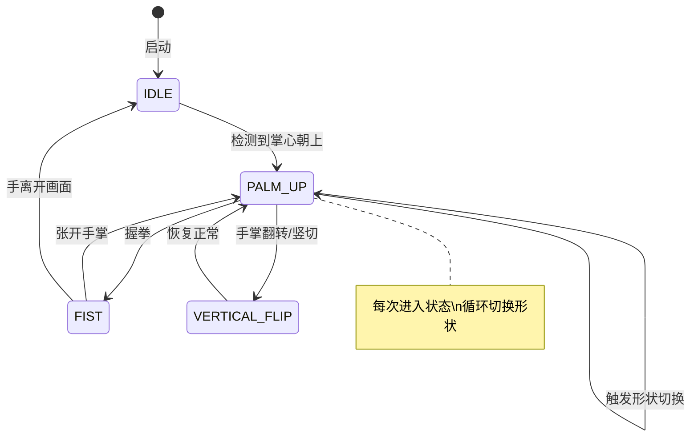
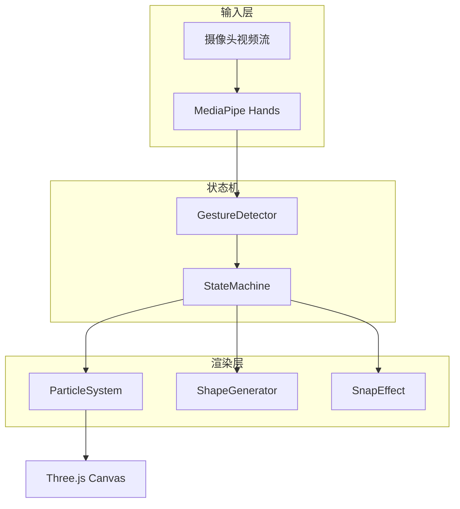

# Hand-Magic 设计文档

> 基于手势识别的交互式粒子系统 - 赛博科幻风格

## 项目概述

创建一个全新的手势粒子交互项目，通过 MediaPipe 手部追踪和 Three.js 实现**状态机驱动**的粒子系统。用户通过不同手势控制粒子的聚拢、爆散、扩展等效果，体验仿佛在手中操控魔法的沉浸式交互。

---

## 核心设计

### 交互状态机



### 手势状态定义

| 状态 | 触发条件 | 粒子行为 |
|------|----------|----------|
| **IDLE** | 无手 / 手模糊 | 粒子随机漂浮在整个画面 |
| **PALM_UP** | 掌心朝上/朝摄像头 | 粒子紧密聚拢成形状，悬浮在掌心上方 10cm |
| **FIST** | 握拳 | 粒子向四周爆炸散开，带有噪声漂移 |
| **VERTICAL_FLIP** | 手掌翻转/竖切动作 | 形状放大 2.5 倍，变稀疏但保持轮廓 |

### 形状循环

每次从非 `PALM_UP` 状态进入 `PALM_UP` 状态时，自动切换到下一个形状：

```
球体 (Sphere) → 圆环 (Ring) → 爱心 (Heart) → 球体...
```

### 特效：响指火花

| 属性 | 值 |
|------|-----|
| **触发** | 拇指-中指距离突变 + 速度阈值 |
| **效果** | 在拇指尖迸发 50 个高速微粒 |
| **持续** | 0.5 秒后淡出 |

---

## 视觉设计

### 参考效果

````carousel

<!-- slide -->

<!-- slide -->

<!-- slide -->

<!-- slide -->

````

### 视觉规范

| 元素 | 规格 |
|------|------|
| **背景** | 摄像头实时视频流（全屏） |
| **粒子颜色** | 白色发光，带柔和光晕 |
| **粒子数量** | 3000 个主粒子 |
| **粒子尺寸** | 1-4px 随机变化 |
| **形状渲染** | 轮廓式（边缘密集，核心稀疏） |
| **动画** | 粒子缓慢自转，lerp 系数 0.15 |
| **UI** | 无控制面板，纯沉浸式体验 |

### 赛博风格增强（可选）

- 霓虹色模式：青色 `#00FFFF` / 品红 `#FF00FF` 渐变
- 粒子拖尾效果
- 形状边缘发光描边

---

## 技术架构

### 技术栈

- **Three.js** - 3D 粒子渲染
- **MediaPipe Hands** - 手部追踪 AI
- **Vanilla JS** - 状态机逻辑

### 项目结构

```
hand-magic/
├── index.html      # 主页面（仅包含 canvas 和 video）
├── style.css       # 全屏样式
├── main.js         # 核心逻辑
└── README.md       # 使用说明
```

### 核心模块



### 关键算法

#### 1. 手势检测逻辑

```javascript
function detectGesture(landmarks) {
    // PALM_UP: 掌心朝向判断
    const palmNormal = calculatePalmNormal(landmarks);
    const isFacingCamera = palmNormal.z < -0.5;
    
    // FIST: 手指弯曲程度
    const fingersCurled = checkFingersCurled(landmarks);
    
    // VERTICAL_FLIP: 手掌倾斜角度
    const palmAngle = calculatePalmTilt(landmarks);
    
    if (fingersCurled) return 'FIST';
    if (palmAngle > 60) return 'VERTICAL_FLIP';
    if (isFacingCamera) return 'PALM_UP';
    return 'IDLE';
}
```

#### 2. 响指检测

```javascript
function detectSnap(landmarks, prevLandmarks, deltaTime) {
    const thumbTip = landmarks[4];
    const middleTip = landmarks[12];
    
    const distance = calculateDistance(thumbTip, middleTip);
    const prevDistance = calculateDistance(prevLandmarks[4], prevLandmarks[12]);
    
    const velocity = (prevDistance - distance) / deltaTime;
    
    // 距离突然变小 + 速度超过阈值 = 响指
    return distance < 0.05 && velocity > 2.0;
}
```

#### 3. 悬浮偏移计算

```javascript
function calculateHoverPosition(landmarks) {
    const palmCenter = landmarks[9]; // 中指根部
    const palmNormal = calculatePalmNormal(landmarks);
    
    // 沿法向量偏移 10cm
    const offset = palmNormal.multiplyScalar(0.1);
    
    return new THREE.Vector3(
        palmCenter.x + offset.x,
        palmCenter.y + offset.y,
        palmCenter.z + offset.z
    );
}
```

---

## 性能优化

| 策略 | 说明 |
|------|------|
| **GPU 粒子** | 使用 `THREE.Points` + 顶点着色器 |
| **LOD** | 手离开时降低粒子更新频率 |
| **对象池** | 响指火花使用对象池复用 |

---

## 验证计划

### 自动化测试
- 无（纯视觉交互项目）

### 手动验证

1. **启动项目**
   ```bash
   cd hand-magic && npx -y http-server -p 8080 -o
   ```

2. **测试用例**

| 测试项 | 操作 | 预期结果 |
|--------|------|----------|
| 基础加载 | 打开页面 | 摄像头背景 + 粒子随机漂浮 |
| PALM_UP | 掌心朝摄像头 | 粒子聚拢成球形，悬浮掌心上方 |
| 形状切换 | 握拳后再张开 | 切换到下一个形状（环/心） |
| FIST | 握拳 | 粒子爆炸散开 |
| VERTICAL_FLIP | 手掌侧翻 | 形状放大变稀疏 |
| 响指 | 拇指+中指弹响 | 火花迸发效果 |

---

## 后续扩展

- [ ] 双手交互（左右手分别控制两个粒子群）
- [ ] 颜色模式切换（白色 / 霓虹 / 彩虹）
- [ ] 粒子轨迹记录 + 回放
- [ ] 移动端适配

---

*设计完成于 2025-12-25*
