# AI 资讯日刊生成系统 - 设计方案

## 项目概述

**AI 资讯日刊生成系统**是一个命令行工具，用于从 Twitter List 收集 AI 相关资讯，通过 Gemini 2.5 Pro 进行智能筛选和整理，最终输出格式化的 Markdown 文件。

### 核心特性

- **手动触发运行** - 按需执行，灵活控制发布节奏
- **多数据源支持** - 支持 TwitterAPI.io、Firecrawl 等多种收集方式
- **智能筛选** - 基于实用价值、技术深度、行业动态、创新性四个维度评分
- **分级输出** - 🔥必读（最多5条）、⭐推荐（最多20条）
- **主题分类** - 按工具应用、大模型、开源项目等分类组织
- **命令行工具** - 专业的 CLI 接口，支持分步或完整执行

---

## 系统架构

### 三大核心模块

```mermaid
graph LR
    A[收集模块] --> B[筛选模块]
    B --> C[生成模块]
    C --> D[Markdown 输出]
```



1. **收集模块（Collector）** - 从多种数据源获取推文
2. **筛选模块（Analyzer）** - 使用 AI 进行智能评分和分级
3. **生成模块（Generator）** - 格式化输出 Markdown 文档

### 数据流

```
Twitter List → 收集 JSON → 分析评分 JSON → 格式化 → Markdown 文件
                ↓              ↓                ↓
            data/date/    data/date/      output/date/
            tweets.json   analyzed.json   daily.md
```

---

## 模块设计详解

### 1. 收集模块（Collector）

#### 设计模式
采用**策略模式**，支持多种数据源，易于扩展。

#### 支持的数据源

| 数据源 | 说明 | 优势 |
|--------|------|------|
| **TwitterAPI.io** | 专业的 Twitter API 服务 | 稳定、成本低、易用 |
| **Firecrawl.dev** | 强大的网页爬取工具 | 灵活、功能丰富 |
| **未来扩展** | RSS、其他社交媒体等 | 可扩展性 |

#### 统一接口

所有数据源实现统一的接口：

```python
class CollectorInterface:
    def collect(self, list_id: str, max_count: int) -> List[Tweet]:
        """
        收集推文
        返回: 标准化的推文列表
        """
        pass

class Tweet:
    text: str           # 推文文本
    author: str         # 作者名称
    url: str            # 推文链接
    published_at: str   # 发布时间
    metadata: dict      # 其他元数据
```

#### 配置

```yaml
collector:
  source: twitterapi  # 默认数据源：twitterapi | firecrawl
  twitter_list_id: "1602502639287435265"
  max_tweets: 500
  
  # TwitterAPI.io 配置
  twitterapi:
    api_key: "your-api-key"
    
  # Firecrawl 配置
  firecrawl:
    api_key: "your-api-key"
```

#### CLI 命令

```bash
# 使用默认数据源收集
./ai-news collect

# 指定数据源
./ai-news collect --source twitterapi
./ai-news collect --source firecrawl

# 指定最大条数
./ai-news collect --max 300
```

---

### 2. 筛选模块（Analyzer）

#### AI 评分系统

使用 **Gemini 2.5 Pro** 进行智能分析，基于四个维度评分。

#### 评分维度与权重

| 维度 | 权重 | 评分标准 |
|------|------|----------|
| **实用价值** | 40% | 工具、教程、解决方案的实用性 |
| **技术深度** | 30% | 技术细节、原理、代码示例 |
| **行业动态** | 20% | 融资、产品、公司新闻的重要性 |
| **创新性** | 10% | 新颖想法、实验项目、前沿研究 |

#### 分级规则

| 级别 | 条件 | 数量限制 | 内容详细度 |
|------|------|----------|-----------|
| 🔥 **必读** | 综合得分 ≥ 85 且至少两个维度突出 | 最多 5 条 | 详细摘要（2-3句话）+ 关键要点 + 链接 + 作者 |
| ⭐ **推荐** | 综合得分 ≥ 70 | 最多 20 条 | 简短摘要（1句话）+ 链接 |
| 其他 | 得分 < 70 | 不输出 | - |

#### 主题分类

每条资讯会被分配到以下主题之一：

- 🛠️ **工具应用** - AI 工具、应用、产品
- 🧠 **大模型** - 大语言模型、多模态模型相关
- 📦 **开源项目** - 开源代码、库、框架
- 📄 **研究论文** - 学术研究、论文解读
- 💼 **行业动态** - 融资、并购、公司新闻
- 🎯 **其他** - 不属于以上分类的内容

#### Prompt 设计

AI 会收到精心设计的 Prompt，包含：

1. **角色定位** - AI 资讯编辑专家
2. **评分标准** - 详细的四维度评分规则
3. **分级要求** - 明确的分级阈值
4. **分类标准** - 主题分类定义
5. **输出格式** - JSON 格式规范

#### 输出格式

```json
{
  "items": [
    {
      "original_tweet": {...},
      "score": {
        "practical": 90,
        "technical": 80,
        "industry": 60,
        "innovation": 70,
        "total": 82
      },
      "level": "must_read",
      "category": "tools",
      "title": "提取的标题",
      "summary": "生成的摘要",
      "key_points": ["要点1", "要点2"]
    }
  ]
}
```

#### 配置

```yaml
analyzer:
  model: gemini-2.5-pro
  api_key: "your-gemini-api-key"
  
  # 评分权重
  weights:
    practical: 0.4
    technical: 0.3
    industry: 0.2
    innovation: 0.1
  
  # 分级阈值
  thresholds:
    must_read: 85
    recommended: 70
  
  # 数量限制
  limits:
    must_read: 5
    recommended: 20
```

---

### 3. 生成模块（Generator）

#### 输出结构

采用**分级 + 分类**的混合组织方式：

```markdown
# AI 资讯日刊 - YYYY-MM-DD

> 本期收录 X 条资讯，其中必读 Y 条，推荐 Z 条

---

## 🔥 必读 (Y)

### 🛠️ 工具应用

- **[标题](链接)** - 详细摘要，2-3句话描述核心内容。关键要点：要点1、要点2、要点3。
  - 👤 作者：@username
  - 🕒 发布时间：YYYY-MM-DD HH:MM

### 🧠 大模型

...

---

## ⭐ 推荐 (Z)

### 🛠️ 工具应用

- **[标题](链接)** - 简短摘要，一句话概括。

### 📦 开源项目

...

---

## 📊 统计信息

- 收集推文数：500
- 通过筛选：25
- 必读级别：5
- 推荐级别：20
```

#### 格式化规则

1. **必读级别**：
   - 包含详细摘要（2-3句话）
   - 列出关键要点
   - 显示作者和发布时间
   - 使用粗体标题

2. **推荐级别**：
   - 只有简短摘要（1句话）
   - 链接到原文
   - 相对精简

3. **排序规则**：
   - 先按级别（必读 > 推荐）
   - 同级别内按主题分类
   - 同主题内按时间倒序

#### 配置

```yaml
generator:
  output_dir: "./output"
  filename_pattern: "ai-news-{date}.md"
  include_statistics: true
```

#### CLI 命令

```bash
# 生成 Markdown
./ai-news generate

# 指定输出路径
./ai-news generate --output ./my-output/news.md
```

---

## 命令行工具设计

### 主要命令

```bash
# === 完整流程（推荐） ===
./ai-news run                    # 执行完整流程
./ai-news run --date 2025-12-21  # 指定日期

# === 分步执行 ===
./ai-news collect                # 1. 收集推文
./ai-news analyze                # 2. AI 筛选分析
./ai-news generate               # 3. 生成 Markdown

# === 配置管理 ===
./ai-news config --show          # 查看当前配置
./ai-news config --edit          # 编辑配置文件
./ai-news config --validate      # 验证配置有效性

# === 历史记录 ===
./ai-news history                # 查看历史生成记录
./ai-news history --date 2025-12-21  # 查看指定日期

# === 工具命令 ===
./ai-news clean                  # 清理旧数据
./ai-news version                # 查看版本信息
./ai-news help                   # 查看帮助
```

### 参数说明

| 参数 | 说明 | 示例 |
|------|------|------|
| `--date` | 指定日期 | `--date 2025-12-21` |
| `--source` | 指定数据源 | `--source firecrawl` |
| `--max` | 最大收集数 | `--max 300` |
| `--output` | 输出路径 | `--output ./output/news.md` |
| `--config` | 配置文件路径 | `--config ./my-config.yaml` |
| `--verbose` | 详细日志 | `--verbose` |
| `--dry-run` | 试运行模式 | `--dry-run` |

---

## 项目结构

```
ai-news-daily/
├── ai-news                      # 主命令行工具
├── config.yaml                  # 配置文件
├── requirements.txt             # Python 依赖
├── README.md                    # 使用文档
│
├── src/                         # 源代码
│   ├── __init__.py
│   ├── cli.py                   # CLI 入口
│   ├── config.py                # 配置管理
│   ├── collector/               # 收集模块
│   │   ├── __init__.py
│   │   ├── base.py              # 基础接口
│   │   ├── twitterapi.py        # TwitterAPI.io 实现
│   │   └── firecrawl.py         # Firecrawl 实现
│   ├── analyzer/                # 筛选模块
│   │   ├── __init__.py
│   │   ├── gemini.py            # Gemini AI 集成
│   │   └── prompts.py           # Prompt 模板
│   └── generator/               # 生成模块
│       ├── __init__.py
│       └── markdown.py          # Markdown 生成器
│
├── data/                        # 数据目录（按日期）
│   └── YYYY-MM-DD/
│       ├── tweets.json          # 收集的推文
│       └── analyzed.json        # 分析结果
│
└── output/                      # 输出目录
    └── ai-news-YYYY-MM-DD.md    # 生成的日刊
```

---

## 技术栈

| 组件 | 技术选型 | 说明 |
|------|----------|------|
| **开发语言** | Python 3.9+ | 成熟、库丰富 |
| **CLI 框架** | Click | 强大的命令行工具框架 |
| **配置管理** | PyYAML | YAML 格式配置 |
| **HTTP 客户端** | httpx | 现代异步 HTTP 库 |
| **AI 集成** | Google Generative AI SDK | 官方 Gemini SDK |
| **日期处理** |  | Python 标准库 |

---

## 配置文件示例

```yaml
# config.yaml

# 收集模块配置
collector:
  source: twitterapi              # 默认数据源
  twitter_list_id: "1602502639287435265"
  max_tweets: 500
  
  twitterapi:
    api_key: "${TWITTER_API_KEY}"  # 支持环境变量
    
  firecrawl:
    api_key: "${FIRECRAWL_API_KEY}"

# 筛选模块配置
analyzer:
  model: gemini-2.5-pro
  api_key: "${GEMINI_API_KEY}"
  
  weights:
    practical: 0.4
    technical: 0.3
    industry: 0.2
    innovation: 0.1
  
  thresholds:
    must_read: 85
    recommended: 70
  
  limits:
    must_read: 5
    recommended: 20

# 生成模块配置
generator:
  output_dir: "./output"
  filename_pattern: "ai-news-{date}.md"
  include_statistics: true
  
  category_icons:
    tools: "🛠️"
    models: "🧠"
    opensource: "📦"
    research: "📄"
    industry: "💼"
    other: "🎯"

# 通用配置
general:
  data_dir: "./data"
  log_level: INFO
  timezone: "Asia/Shanghai"
```

---

## 工作流程示例

### 典型使用场景

```bash
# 1. 初次使用：配置
./ai-news config --edit
# 编辑配置文件，填入 API keys

# 2. 执行完整流程
./ai-news run

# 输出：
# ✓ 正在收集推文... (使用 twitterapi)
# ✓ 收集到 500 条推文
# ✓ 正在分析评分... (使用 gemini-2.5-pro)
# ✓ 分析完成：必读 5 条，推荐 20 条
# ✓ 正在生成 Markdown...
# ✓ 已生成：./output/ai-news-2025-12-21.md

# 3. 查看结果
cat ./output/ai-news-2025-12-21.md
```

### 调试场景

```bash
# 分步执行，便于调试
./ai-news collect --verbose
./ai-news analyze --verbose
./ai-news generate --verbose

# 查看中间数据
cat ./data/2025-12-21/tweets.json
cat ./data/2025-12-21/analyzed.json
```

---

## 扩展性设计

### 未来可扩展的功能

1. **更多数据源**
   - RSS 订阅
   - Reddit 帖子
   - Hacker News
   - 微信公众号

2. **更多输出格式**
   - HTML 网页
   - PDF 文档
   - Email 模板
   - 微信推送格式

3. **高级功能**
   - 定时自动化（cron job）
   - Web 管理界面
   - 用户反馈学习
   - 个性化偏好调整

4. **数据分析**
   - 历史趋势分析
   - 热点话题追踪
   - 来源质量评估

---

## 总结

本设计方案提供了一个灵活、可扩展的 AI 资讯日刊生成系统。核心特点：

✅ **手动触发，灵活控制**  
✅ **多数据源支持，易于扩展**  
✅ **智能筛选，四维度评分**  
✅ **分级输出，重点突出**  
✅ **专业 CLI 工具，易于使用**  
✅ **配置驱动，快速定制**  

通过这套系统，你可以高效地收集、筛选和整理 AI 领域的最新资讯，生成高质量的日刊内容。
