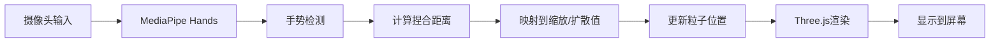

# 3D粒子系统 - 手势交互

一个基于Three.js和MediaPipe的实时交互3D粒子系统，通过摄像头检测手势来控制粒子的缩放和扩散效果。

  

## ✨ 特性

- 🎨 **5种粒子模型**：圣诞树、星星、烟花、爱心、地球
- 👋 **手势控制**：通过摄像头实时检测手部动作
- 🌈 **颜色自定义**：使用颜色选择器调整粒子颜色
- 📱 **响应式设计**：支持桌面和移动设备
- 🎭 **现代UI**：玻璃态设计风格，流畅动画效果
- ⚡ **高性能**：60fps流畅渲染，支持数千粒子

## 🚀 快速开始

### 环境要求

- 现代浏览器（Chrome、Edge、Safari等）
- 支持WebGL
- 摄像头设备
- 网络连接（用于加载CDN资源）

### 本地运行

1. **克隆或下载项目**
   ```bash
   cd particle-system
   ```

2. **启动本地服务器**
   ```bash
   # 使用http-server（推荐）
   npx -y http-server -p 8080 -o
   
   # 或使用Python
   python -m http.server 8080
   
   # 或使用Node.js
   npx -y serve -p 8080
   ```

3. **访问应用**
   
   在浏览器中打开：`http://localhost:8080`

4. **授权摄像头**
   
   首次访问时，浏览器会请求摄像头权限，点击"允许"即可。

## 📖 使用说明

### 手势控制

**捏合手势**：
- 将手伸向摄像头
- 用**拇指**和**食指**做出捏合动作
- **张开手指** → 粒子扩散、放大
- **捏紧手指** → 粒子聚拢、缩小

**实时反馈**：
- 左上角显示手势追踪状态（绿点=已检测，红点=未检测）
- 左下角显示当前缩放倍数

### 界面操作

#### 模型选择（左侧面板）

点击任意模型按钮切换粒子形状：

| 图标 | 模型 | 粒子数 | 描述 |
|------|------|--------|------|
| 🎄 | 圣诞树 | 3,000 | 圆锥形状，顶部带星星 |
| ⭐ | 星星 | 2,500 | 五角星形状 |
| 🎆 | 烟花 | 4,000 | 爆炸式放射状 |
| ❤️ | 爱心 | 2,800 | 心形曲线 |
| 🌍 | 地球 | 3,500 | 球形地球仪 |

#### 颜色选择

1. 点击颜色选择器（色块）
2. 从调色板中选择颜色
3. 粒子颜色实时更新

**默认颜色**：紫色渐变 (#8a2be2)

#### 全屏模式

- 点击右下角的全屏按钮 (⛶)
- 再次点击或按 `ESC` 键退出全屏

## 🎮 操作示例

### 基础流程

```
1. 打开应用 → 等待加载完成
2. 允许摄像头权限
3. 将手伸向摄像头
4. 做出捏合手势 → 观察粒子变化
5. 切换不同模型 → 体验不同效果
6. 调整颜色 → 个性化定制
```

### 最佳体验建议

- **光线充足**：确保环境光线良好，便于手部检测
- **背景简洁**：避免复杂背景干扰手势识别
- **距离适中**：手部距离摄像头30-60cm为佳
- **动作清晰**：手势动作要明确，避免过快移动

## 🛠️ 技术架构

### 核心技术栈

- **Three.js v0.150.0** - 3D渲染引擎
- **MediaPipe Hands** - 手部追踪AI模型
- **Vanilla JavaScript** - 应用逻辑
- **Modern CSS** - 玻璃态UI设计

### 项目结构

```
particle-system/
├── index.html          # 主页面，包含UI结构
├── style.css           # 样式文件，玻璃态设计
├── main.js            # 核心逻辑，粒子系统+手势控制
└── README.md          # 使用文档（本文件）
```

### 工作原理



**手势映射算法**：
```javascript
// 捏合距离 → 缩放倍数
距离范围: 0.02 - 0.3
缩放范围: 3.0x - 0.5x (反向映射)

// 捏合距离 → 扩散程度
距离范围: 0.02 - 0.3
扩散范围: 0 - 2.0
```

## 🎨 粒子模型详解

### 1. 🎄 圣诞树

**算法**：圆锥螺旋
```javascript
height = t * 4 - 2              // 高度从-2到2
radius = (1 - t) * 1.5          // 半径从1.5递减到0
angle = t * π * 8               // 螺旋角度
```

### 2. ⭐ 星星

**算法**：五角星极坐标
```javascript
angle = (i / count) * π * 10    // 10个周期形成5个角
radius = (i % 2 === 0 ? 2 : 1)  // 交替内外半径
```

### 3. 🎆 烟花

**算法**：球面随机分布
```javascript
φ = random() * π * 2            // 方位角
θ = random() * π                // 极角
r = pow(random(), 0.5) * 2.5    // 非均匀半径
```

### 4. ❤️ 爱心

**算法**：参数方程
```javascript
x = 16 * sin³(t) / 16
y = (13cos(t) - 5cos(2t) - 2cos(3t) - cos(4t)) / 16
```

### 5. 🌍 地球

**算法**：均匀球面分布
```javascript
φ = random() * π * 2            // 经度
θ = acos(2 * random() - 1)      // 纬度（均匀分布）
r = 1.8                         // 固定半径
```

## 🔧 自定义配置

### 修改粒子数量

编辑 `main.js` 中的配置：

```javascript
const particleConfigs = {
    tree: { count: 3000, spread: 2 },      // 修改count值
    star: { count: 2500, spread: 2.5 },
    // ...
};
```

### 调整手势灵敏度

修改 `onHandsResults` 函数中的映射范围：

```javascript
// 更灵敏：减小距离范围
targetScale = mapRange(distance, 0.01, 0.2, 3.0, 0.5);

// 更迟钝：增大距离范围
targetScale = mapRange(distance, 0.05, 0.4, 3.0, 0.5);
```

### 更改默认颜色

修改 `main.js` 中的初始颜色：

```javascript
let particleColor = new THREE.Color(0xff0000);  // 红色
```

同时更新 `index.html` 中的颜色选择器默认值：

```html
<input type="color" id="colorPicker" value="#ff0000">
```

## 📱 移动端适配

应用已针对移动设备优化：

- 控制面板自动移至底部
- 触摸友好的按钮尺寸
- 响应式布局适配小屏幕
- 优化性能以适应移动GPU

**注意**：部分移动设备可能因性能限制导致帧率下降。

## 🐛 常见问题

### 摄像头无法启动

**解决方案**：
1. 检查浏览器权限设置
2. 确保使用HTTPS或localhost
3. 尝试刷新页面重新授权

### 手势检测不准确

**解决方案**：
1. 改善环境光线
2. 清理摄像头镜头
3. 简化背景
4. 调整手部距离

### 粒子渲染卡顿

**解决方案**：
1. 关闭其他占用GPU的程序
2. 减少粒子数量（见自定义配置）
3. 使用性能更好的设备
4. 关闭浏览器硬件加速后重新开启

### 页面加载失败

**解决方案**：
1. 检查网络连接（需要加载CDN资源）
2. 清除浏览器缓存
3. 尝试其他浏览器

## 🌐 浏览器兼容性

| 浏览器 | 版本 | 支持状态 |
|--------|------|----------|
| Chrome | 90+ | ✅ 完全支持 |
| Edge | 90+ | ✅ 完全支持 |
| Safari | 14+ | ✅ 支持 |
| Firefox | 88+ | ⚠️ 部分支持* |

*Firefox可能需要手动启用WebGL和摄像头权限

## 📄 许可证

本项目仅供学习和演示使用。

## 🤝 贡献

欢迎提交问题和改进建议！

## 📞 联系方式

如有问题或建议，请通过以下方式联系：
- 提交Issue
- 发送邮件

---

**享受3D粒子的魔法世界！** ✨🎨👋
